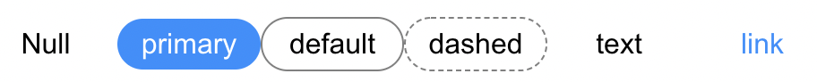

# rain-bowses

> Rain Bowses


## Install

```bash
npm install --save rain-bowses
```

## Usage

```jsx
import React from 'react'

import { Button } from 'rain-bowses'
import 'rain-bowses/dist/index.css'

const App = () => {
  return (
    <div className='App'>
      <Button text='Null' />
      <Button type='primary' text='primary' />
      <Button type='default' text='default' />
      <Button type='text' text='text' />
      <Button type='link' text='link' />
      <Button type='dashed' text='dashed' />
    </div>
  )
}

export default App
```




## License

MIT © [mucahitkok](https://github.com/mucahitkok)
# rain-bow
